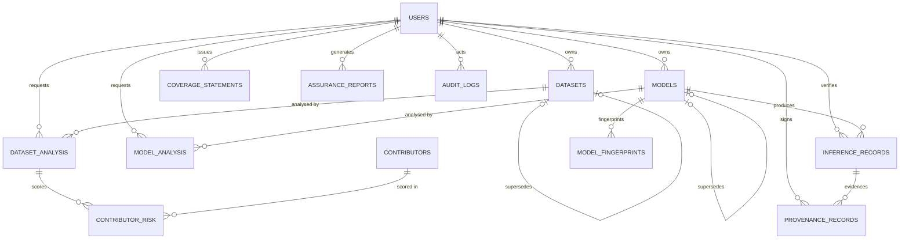

# TRUSTVISION — PostgreSQL Database Design

Schema DDL: [`db/schema.sql`](db/schema.sql) · PostgreSQL 16+ · 13 tables, 22 enum domains.

---

## 1. ER Diagram

```
                                   ┌───────────────┐
                                   │     users     │
                                   └───────┬───────┘
     owner_id │ requested_by │ verified_by │ signed_by │ issued_by │ generated_by │ actor_id
   ┌──────────┼──────────────┼─────────────┼───────────┼───────────┼──────────────┴───┐
   │          │              │             │           │           │                  │
   ▼          │              │             │           │           │                  │
┌──────────┐  │              │             │           │           │                  │
│ datasets │──┘              │             │           │           │                  │
└────┬─────┘                 │             │           │           │                  │
     │ 1:N                   │             │           │           │                  │
     ▼                       │             │           │           │                  │
┌──────────────────┐         │             │           │           │                  │
│ dataset_analysis │◄────────┘             │           │           │                  │
└───┬──────────┬───┘                       │           │           │                  │
    │ 1:N      │ 1:N                       │           │           │                  │
    ▼          └──────────────┐            │           │           │                  │
┌──────────────────┐          ▼            │           │           │                  │
│ contributor_risk │   ┌───────────────┐  │           │           │                  │
└────────┬─────────┘   │ coverage_     │◄─┼───────────┼───────────┘                  │
         │ N:1         │ statements    │  │           │                              │
         ▼             └───────────────┘  │           │                              │
┌───────────────┐                         │           │                              │
│ contributors  │                         │           │                              │
└───────────────┘                         ▼           ▼                              ▼
                                   ┌─────────────────────────┐            ┌───────────────────┐
        ┌──────────┐               │ provenance_records      │            │ assurance_reports │
        │  models  │               │ (hash-chained per       │            └───────────────────┘
        └────┬─────┘               │  subject: dataset /     │
             │ 1:N                 │  model / inference)     │
   ┌─────────┼──────────────┐      └───────────┬─────────────┘
   │         │              │                  │ N:1 (optional, cascaded)
   ▼         ▼              │                  ▼
┌─────────────────────┐     │      ┌───────────────────┐
│ model_analysis      │     │      │ inference_records │◄──────┐
└─────────────────────┘     │      └─────────┬─────────┘       │
   ▲                        │                │ 1:N             │ 1:N
   │ N:1                    │                └─────────────────┼──── models (model_id)
┌──┴──────────────┐        │
│ model_          │        │      ┌───────────────────┐
│ fingerprints    │        └─────►│    audit_logs     │ (actor_id → users; polymorphic
└─────────────────┘               │ append-only, hash │  target_type/target_id → any)
                                  │ chained, monthly  │
datasets ─self─ supersedes_id     │ partitions)       │
models   ─self─ supersedes_id     └───────────────────┘
```

Polymorphic references (enforced in the service layer, no SQL FK possible):

| Table | Columns | Points to |
|---|---|---|
| `provenance_records` | `subject_type`, `subject_id` | `datasets` \| `models` \| `inference_records` |
| `coverage_statements` | `subject_type`, `subject_id` | same |
| `assurance_reports` | `subject_type`, `subject_id` | same |
| `audit_logs` | `target_type`, `target_id` | any auditable entity |

Mermaid version (renders on GitHub):



---

## 2. Relationships

| # | Relationship | Cardinality | FK / mechanism |
|---|--------------|-------------|----------------|
| 1 | users → datasets | 1:N | `datasets.owner_id` |
| 2 | users → models | 1:N | `models.owner_id` |
| 3 | datasets → dataset_analysis | 1:N | `dataset_analysis.dataset_id` (CASCADE) |
| 4 | dataset_analysis → contributor_risk | 1:N | `contributor_risk.dataset_analysis_id` (CASCADE) |
| 5 | contributors → contributor_risk | 1:N | `contributor_risk.contributor_id` |
| 6 | models → model_analysis | 1:N | `model_analysis.model_id` (CASCADE) |
| 7 | models → model_fingerprints | 1:N | `model_fingerprints.model_id` (CASCADE) |
| 8 | model_analysis → model_fingerprints | 1:N optional | ON DELETE SET NULL — fingerprint outlives the run |
| 9 | models → inference_records | 1:N | `inference_records.model_id` |
| 10 | datasets → inference_records | 1:N optional | `inference_records.dataset_id` (operational context) |
| 11 | inference_records → provenance_records | 1:N | `provenance_records.inference_record_id` (CASCADE) |
| 12 | dataset_analysis / model_analysis → coverage_statements | 1:N optional | nullable FKs, one of the two |
| 13 | dataset_analysis / model_analysis → assurance_reports | 1:N optional | nullable FKs + polymorphic subject |
| 14 | users → audit_logs | 1:N | `audit_logs.actor_id` (NULL = system actor) |
| 15 | datasets → datasets (version lineage) | self | `supersedes_id` |
| 16 | models → models (version lineage) | self | `supersedes_id` |
| 17 | coverage_statements → coverage_statements | self | `superseded_by` |

Cascade policy: analysis runs and their dependent findings are deleted with
their subject; `provenance_records` for an inference are deleted with it, while
provenance for datasets/models lives as long as the subject. Audit logs are
never deleted.

---

## 3. How the four requirements are supported

### 3.1 Audit trail
- `audit_logs` is **append-only**: `BEFORE UPDATE OR DELETE` trigger raises an
  exception; the owning DB role has INSERT/SELECT only.
- **Hash chain**: `entry_hash = SHA-256(prev_hash ‖ canonical_json(entry))` —
  tampering breaks the chain and the nightly verification job fails.
- **Range-partitioned** by month (`PARTITION BY RANGE (occurred_at)`, default +
  monthly partitions created ahead by a scheduled job) for cheap retention and
  fast time-range queries.
- Analyses additionally store `result_sha256` so the exact artifact a decision
  was based on can be re-verified later.

### 3.2 Cryptographic provenance
- `provenance_records` keeps a per-subject hash chain (`prev_hash`/`entry_hash`)
  of typed entries: `INPUT_SHA256`, `MODEL_DIGEST`, `CONFIG_HASH`, `NONCE`,
  `HMAC_SIGNATURE`, `DIGITAL_SIGNATURE`, `CHAIN_ENTRY` — with optional detached
  `signature` and `signed_by`.
- `model_fingerprints` records multiple digests per model artefact (file,
  weights, ONNX graph, TorchScript code, layer-stat vector) — the identity used
  to prove "the exact model that was assessed is the model that ran".
- Every ingested artefact (`datasets.sha256`, `models.sha256`,
  `inference_records.image_sha256`) and every signed report
  (`assurance_reports.sha256` + `signature`) is fingerprinted.

### 3.3 Contributor risk scoring
- `contributors` is the supply-chain entity; `contributor_risk` is the
  **score snapshot per dataset analysis** (unique per
  `(dataset_analysis_id, contributor_id)`), storing `samples_contributed`,
  `risk_score` 0–100, `risk_level`, a `factors` jsonb breakdown (weights and
  raw inputs — makes every score explainable and auditable) and a `flagged`
  marker. Historical scores are preserved per run, so risk evolution over
  dataset versions is queryable.

### 3.4 White-box and black-box assessments
- `model_analysis.assessment_mode` (`WHITE_BOX` | `BLACK_BOX`).
- A table CHECK (`model_analysis_whitebox_evidence_chk`) forces white-box runs
  to record graph-level evidence: `graph_hash` + `op_allowlist_violations`.
  Black-box runs leave those NULL and rely on probe scores.
- `access_verdict` (`ACCESSIBLE` / `LIMITED`) captures whether deep inspection
  was possible — feeding the Assurance Summary and reports.
- `coverage_statements` documents scope/limitations either way (e.g.
  "black-box probe covered 92% of classes").

---

## 4. Indexes & rationale

| Index | Type | Purpose |
|---|---|---|
| `users.username` (UNIQUE) | btree | login lookup |
| `idx_datasets_owner` | btree | "my datasets" lists |
| `idx_datasets_format_state` | btree | COCO/YOLO + state filters |
| `idx_datasets_sha256` | btree | duplicate-ingest detection |
| `idx_datasets_supersedes` | btree | version lineage walk |
| `idx_dataset_analysis_dataset` | btree (dataset_id, created_at DESC) | latest runs first |
| `idx_dataset_analysis_active` | partial (`status <> 'COMPLETED'`) | tiny hot index for the job dashboard |
| `contributor_risk_uq` (UNIQUE analysis+contributor) | btree | one score per contributor per run |
| `idx_contributor_risk_flagged` | partial (`WHERE flagged`) | flagged-contributor review queue |
| `idx_models_sha256` | btree | duplicate artefact detection |
| `idx_model_analysis_model`, `idx_model_analysis_mode` | btree | history, white/black-box filtering |
| `model_fingerprints_uq` (UNIQUE model+type+value) | btree | dedupe + provenance lookup |
| `idx_model_fingerprints_value` | btree | "which model has this digest?" reverse lookup |
| `idx_inference_model_time` | btree (model_id, executed_at DESC) | monitoring timelines |
| `idx_inference_verdict`, `idx_inference_image` | btree | verdict queues, image tracing |
| `idx_provenance_subject` (subject_type, subject_id, created_at) | btree | chain walk in order |
| `idx_provenance_inference` | btree | per-inference evidence fetch |
| `idx_audit_occurred`, `idx_audit_actor`, `idx_audit_module_action`, `idx_audit_target` | btree (on parent → all partitions) | audit queries |
| `idx_coverage_subject`, `idx_coverage_status` | btree | report assembly |
| `idx_reports_subject`, `idx_reports_generated` | btree | report history |

Uniqueness is also enforced by: `users.username`, `contributors.name`,
`model_fingerprints_uq`, `contributor_risk_uq` (each creates its backing index).

---

## 5. Conventions & operational notes

- **Keys**: UUID v4 via `pgcrypto.gen_random_uuid()`; on PostgreSQL 18+ switch
  defaults to `uuidv7()` (time-ordered, better index locality). `audit_logs.id`
  is `bigint GENERATED ALWAYS AS IDENTITY` (required by the partition key).
- **Hex-digest CHECKs** (`^[0-9a-f]{64}$`) guard every SHA-256 column.
- **jsonb** is used only for genuinely schema-flexible payloads (drift vectors,
  finding detail, risk factor breakdowns, coverage scope); every filtered or
  aggregated field is a real typed column.
- **Partitions**: create next month's `audit_logs_YYYY_MM` partition before the
  current one fills; the DEFAULT partition is a safety net, not a home.
- **Role hardening (recommended)**: app role with `INSERT/SELECT/UPDATE` on
  business schemas, `INSERT/SELECT` only on `audit_logs`, and no `DELETE`
  anywhere except the `dataset_analysis`/`model_analysis` cascade owners.
- **Verification jobs** (nightly): re-walk `audit_logs` and
  `provenance_records` chains, recompute `entry_hash`, alert on mismatch.
- **Enums vs lookups**: ENUMs are used for stable domains; if a value set is
  expected to grow (e.g. new finding types), migrate to lookup tables — the FK
  shape does not change.
